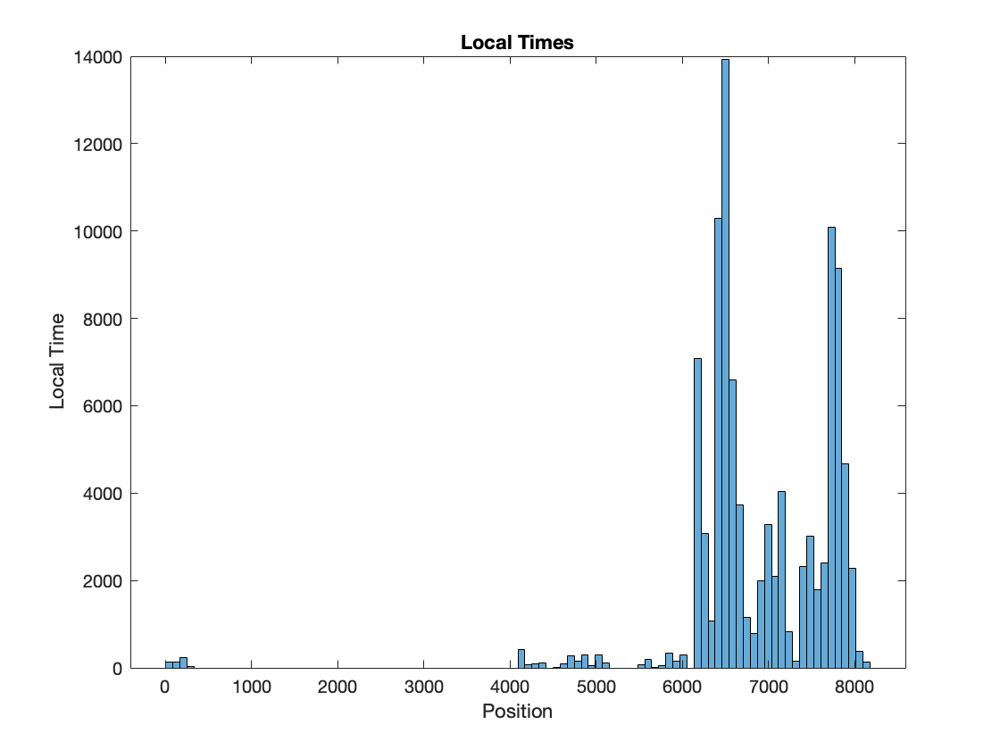
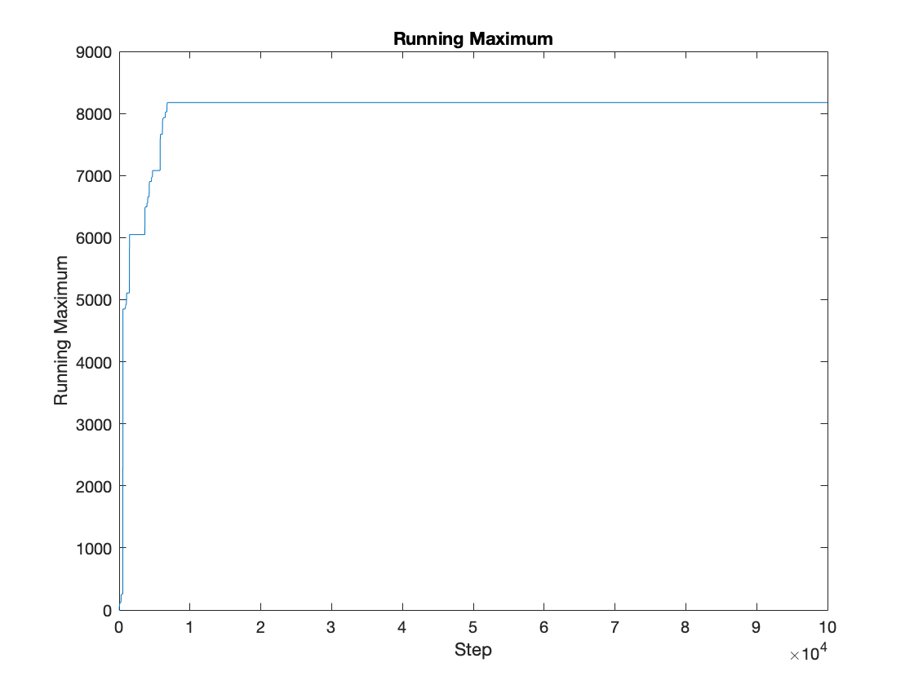

# Hierarchical ERRW
This script samples trajectories of a reinforced hierarchical random walk. The (unnormalized) initial transition matrix can be written as

where  is block diagonal with  blocks of ones on the diagonal. To set an effective (spectral) dimension of , one sets

As the walk transitions from  to , we find the smallest  such that  has block containing  and . We then change the entries in this block from  to . This effectively changes the "dimension of the block" to .

The model should have a recurrence-transience transition when , which corresponds to effective dimension greater than 2, but .

As output, the script shows the random walk's trajectory, the local time spent at each site, and the running maximum of the trajectory (the "furthest" point reached by the walk).

Here are the figures produced by the default settings (in the recurrent regime):

